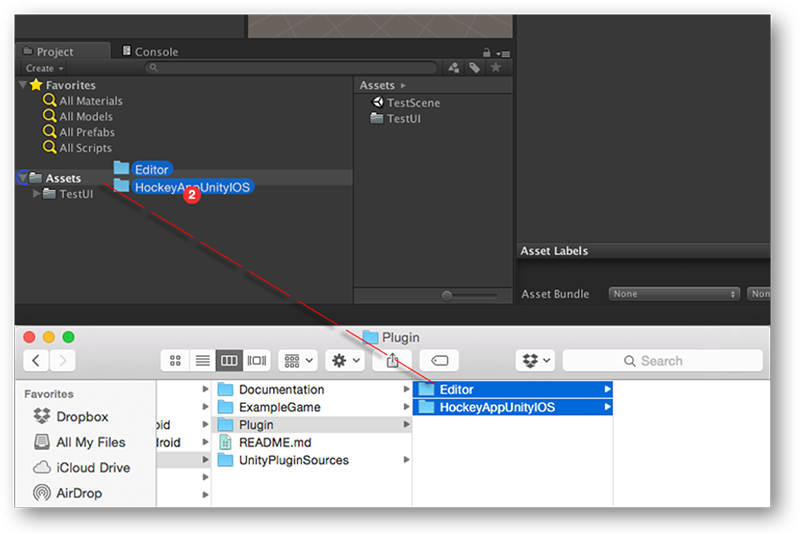
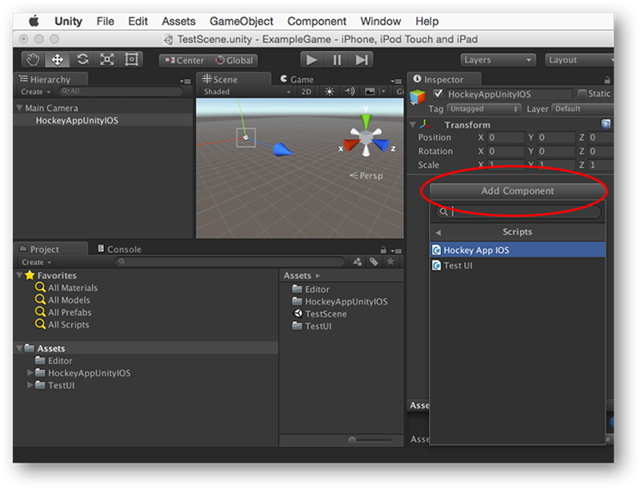

## Introduction 

The HockeyAppUnity-iOS plugin implements support for using HockeyApp in your Unity3D-iOS builds. It easily lets you keep track of crashes that have been caused by your scripts or Objective-C code.

## Requirements

* Unity 4.2 or newer (older versions might work, but we haven't tested them).
* iOS 5 or newer.

## Installation & Setup

The following steps illustrate how to integrate the HockeyAppUnity-iOS plugin:

### 1) Import plugin
Copy the **Plugins** folder (*Plugin/Plugins*) and the **Editor** folder (*Plugin/Editor*) folder into the **Assets** directory of your Unity3D project.

### 2) Create plugin-GameObject
Create an empty game object (*GameObject -> Create Empty*) and rename it (*HockeyAppUnityIOS*).

Add the **HockeyAppIOS.cs** as a component of your new created gameobject.

Select the game object in the **Hierarchy** pane and fill in some additional informations inside the Inspector window. 

* **App ID** - the app ID provided by HockeyApp
* **Exception Logging** - by checking this option you will get more precise information about exceptions in your Unity3D scripts
* **Update Manager** - ckeck this option if users should be informed about app updates from inside your app
* **Authentication Type** - an authentication type as string (see [Authenticating Users on iOS](http://support.hockeyapp.net/kb/client-integration-ios-mac-os-x/authenticating-users-on-ios))
* **Secret** - the secret provided by HockeyApp (only for authentication using email address)

### 3) Modify post process script
Open PostProcessBuildPlayer (*Editor/PostProcessBuildPlayer*) and modify line 116:
		
	# replace YOUR-APP-ID with the app ID provided by HockeyApp
	appID = 'YOUR-APP-ID'

### 4) Configure build settings

You are now ready to build the Xcode project: Select *File -> Build Settings...* and switch to **iOS** in the platform section. Check **Development Build** and **Script Debugging** (see [Build Settings](#build_settings) section).

Open the player settings and make sure that **Bundle identifier** (*Other settings -> Identification*) equals the package name of your HockeyApp app.

If you want to enable exception logging, please also select *Other settings -> Optimization -> Slow and safe* as well. Otherwise all exceptions will result in an app crash.

Press the **Build** button. You can now build and run your app.

## Build Settings ##

The **Development Build** and **Script Debugging** options affect the exception handling in C#. You will get a crash report in any case, but the data quality differs. It is recommend to enable those options for alpha and beta builds, but to disable them for production.

**Disabled Development Build, Disabled Script Debugging**:
	
Apple-style crash report for those exception types that cause a crash.

**Enabled Development Build, Disabled Script Debugging**

	IndexOutOfRangeException: Array index is out of range.
 		at (wrapper stelemref) object:stelemref (object,intptr,object)
 		at TestUI.OnGUI ()
 		
**Enabled Development Build, Enabled Script Debugging**:

	IndexOutOfRangeException: Array index is out of range.
 		at (wrapper stelemref) object:stelemref (object,intptr,object)
 		at TestUI.OnGUI () (at /Users/name/Documents/Workspace/HockeySDK-Unity-iOS/ExampleGame/Assets/TestUI/TestUI.cs:73)
 		
## Examples

### Feedback Form

In order to provide your users with a feedback form, please define the following extern method in your C# script: 
	
	[DllImport("__Internal")]
	private static extern void HockeyApp_ShowFeedbackListView();
	
After that you can show the feedback form as follows:
	
	HockeyApp_ShowFeedbackListView(); 
	
## Licenses

The Hockey SDK is provided under the following license:

    The MIT License
    Copyright (c) 2012-2014 HockeyApp, Bit Stadium GmbH.
    All rights reserved.
	
    Permission is hereby granted, free of charge, to any person
    obtaining a copy of this software and associated documentation
    files (the "Software"), to deal in the Software without
    restriction, including without limitation the rights to use,
    copy, modify, merge, publish, distribute, sublicense, and/or sell
    copies of the Software, and to permit persons to whom the
    Software is furnished to do so, subject to the following
    conditions:

    The above copyright notice and this permission notice shall be
    included in all copies or substantial portions of the Software.
	
    THE SOFTWARE IS PROVIDED "AS IS", WITHOUT WARRANTY OF ANY KIND,
    EXPRESS OR IMPLIED, INCLUDING BUT NOT LIMITED TO THE WARRANTIES
    OF MERCHANTABILITY, FITNESS FOR A PARTICULAR PURPOSE AND
    NONINFRINGEMENT. IN NO EVENT SHALL THE AUTHORS OR COPYRIGHT
    HOLDERS BE LIABLE FOR ANY CLAIM, DAMAGES OR OTHER LIABILITY,
    WHETHER IN AN ACTION OF CONTRACT, TORT OR OTHERWISE, ARISING
    FROM, OUT OF OR IN CONNECTION WITH THE SOFTWARE OR THE USE OR
    OTHER DEALINGS IN THE SOFTWARE.

Except as noted below, PLCrashReporter 
is provided under the following license:

    Copyright (c) 2008 - 2014 Plausible Labs Cooperative, Inc.
    Copyright (c) 2012 - 2014 HockeyApp, Bit Stadium GmbH.
    All rights reserved.

    Permission is hereby granted, free of charge, to any person
    obtaining a copy of this software and associated documentation
    files (the "Software"), to deal in the Software without
    restriction, including without limitation the rights to use,
    copy, modify, merge, publish, distribute, sublicense, and/or sell
    copies of the Software, and to permit persons to whom the
    Software is furnished to do so, subject to the following
    conditions:

    The above copyright notice and this permission notice shall be
    included in all copies or substantial portions of the Software.

    THE SOFTWARE IS PROVIDED "AS IS", WITHOUT WARRANTY OF ANY KIND,
    EXPRESS OR IMPLIED, INCLUDING BUT NOT LIMITED TO THE WARRANTIES
    OF MERCHANTABILITY, FITNESS FOR A PARTICULAR PURPOSE AND
    NONINFRINGEMENT. IN NO EVENT SHALL THE AUTHORS OR COPYRIGHT
    HOLDERS BE LIABLE FOR ANY CLAIM, DAMAGES OR OTHER LIABILITY,
    WHETHER IN AN ACTION OF CONTRACT, TORT OR OTHERWISE, ARISING
    FROM, OUT OF OR IN CONNECTION WITH THE SOFTWARE OR THE USE OR
    OTHER DEALINGS IN THE SOFTWARE.

The protobuf-c library, as well as the PLCrashLogWriterEncoding.c
file are licensed as follows:

    Copyright 2008, Dave Benson.

    Licensed under the Apache License, Version 2.0 (the "License");
    you may not use this file except in compliance with
    the License. You may obtain a copy of the License
    at http://www.apache.org/licenses/LICENSE-2.0 Unless
    required by applicable law or agreed to in writing,
    software distributed under the License is distributed on
    an "AS IS" BASIS, WITHOUT WARRANTIES OR CONDITIONS OF ANY
    KIND, either express or implied. See the License for the
    specific language governing permissions and limitations
    under the License.

TTTAttributedLabel is licensed as follows:

    Copyright (c) 2011 Mattt Thompson (http://mattt.me/)
    
    Permission is hereby granted, free of charge, to any person
    obtaining a copy of this software and associated documentation
    files (the "Software"), to deal in the Software without
    restriction, including without limitation the rights to use,
    copy, modify, merge, publish, distribute, sublicense, and/or sell
    copies of the Software, and to permit persons to whom the
    Software is furnished to do so, subject to the following
    conditions:

    The above copyright notice and this permission notice shall be
    included in all copies or substantial portions of the Software.

    THE SOFTWARE IS PROVIDED "AS IS", WITHOUT WARRANTY OF ANY KIND,
    EXPRESS OR IMPLIED, INCLUDING BUT NOT LIMITED TO THE WARRANTIES
    OF MERCHANTABILITY, FITNESS FOR A PARTICULAR PURPOSE AND
    NONINFRINGEMENT. IN NO EVENT SHALL THE AUTHORS OR COPYRIGHT
    HOLDERS BE LIABLE FOR ANY CLAIM, DAMAGES OR OTHER LIABILITY,
    WHETHER IN AN ACTION OF CONTRACT, TORT OR OTHERWISE, ARISING
    FROM, OUT OF OR IN CONNECTION WITH THE SOFTWARE OR THE USE OR
    OTHER DEALINGS IN THE SOFTWARE.

SFHFKeychainUtils is licensed as follows:

    Created by Buzz Andersen on 10/20/08.
    Based partly on code by Jonathan Wight, Jon Crosby, and Mike Malone.
    Copyright 2008 Sci-Fi Hi-Fi. All rights reserved.
    
    Permission is hereby granted, free of charge, to any person
    obtaining a copy of this software and associated documentation
    files (the "Software"), to deal in the Software without
    restriction, including without limitation the rights to use,
    copy, modify, merge, publish, distribute, sublicense, and/or sell
    copies of the Software, and to permit persons to whom the
    Software is furnished to do so, subject to the following
    conditions:

    The above copyright notice and this permission notice shall be
    included in all copies or substantial portions of the Software.

    THE SOFTWARE IS PROVIDED "AS IS", WITHOUT WARRANTY OF ANY KIND,
    EXPRESS OR IMPLIED, INCLUDING BUT NOT LIMITED TO THE WARRANTIES
    OF MERCHANTABILITY, FITNESS FOR A PARTICULAR PURPOSE AND
    NONINFRINGEMENT. IN NO EVENT SHALL THE AUTHORS OR COPYRIGHT
    HOLDERS BE LIABLE FOR ANY CLAIM, DAMAGES OR OTHER LIABILITY,
    WHETHER IN AN ACTION OF CONTRACT, TORT OR OTHERWISE, ARISING
    FROM, OUT OF OR IN CONNECTION WITH THE SOFTWARE OR THE USE OR
    OTHER DEALINGS IN THE SOFTWARE.
