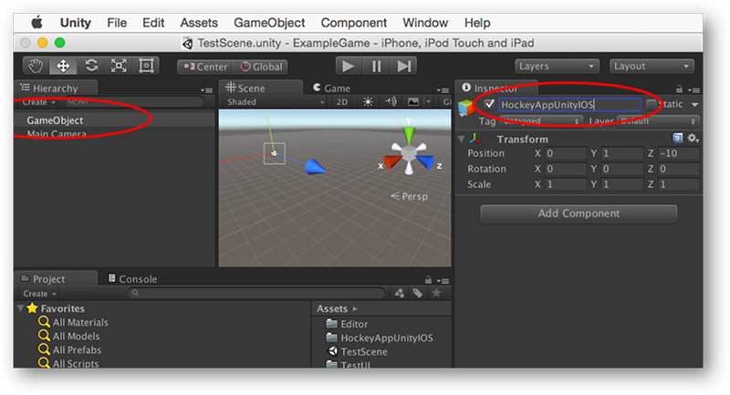
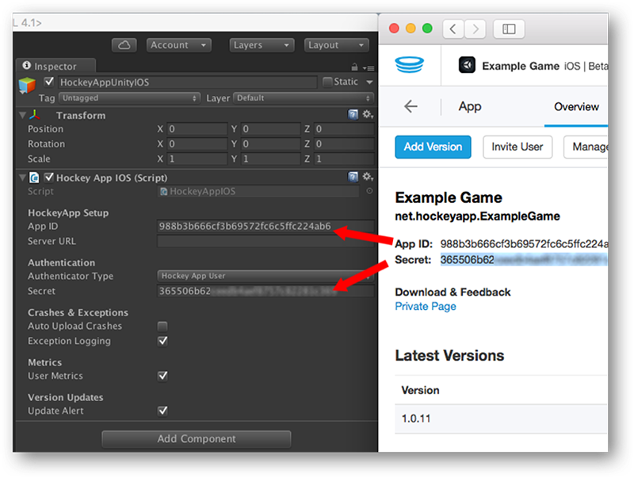
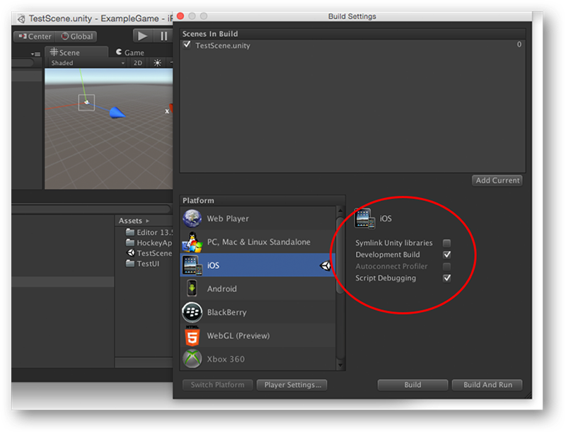
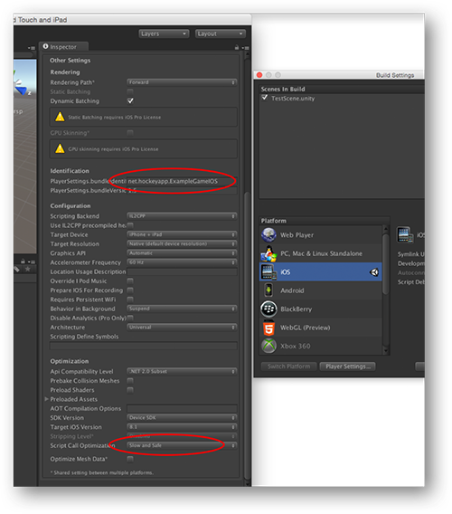
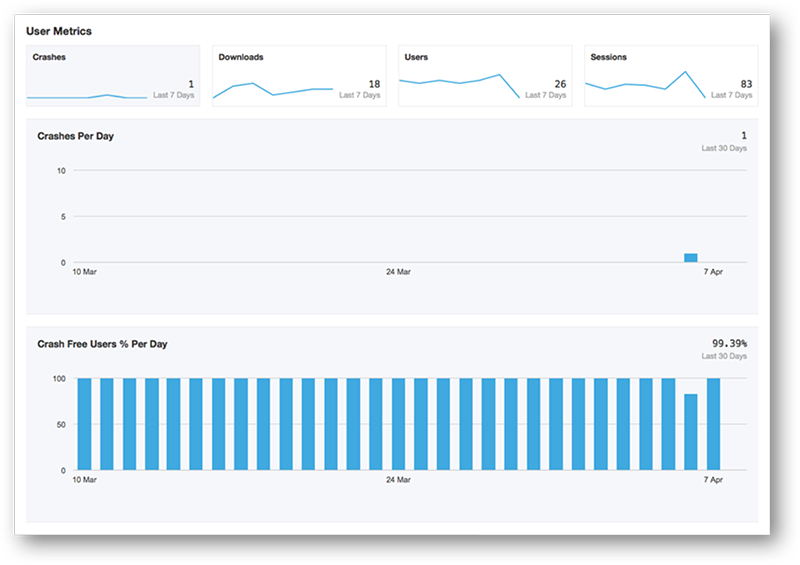
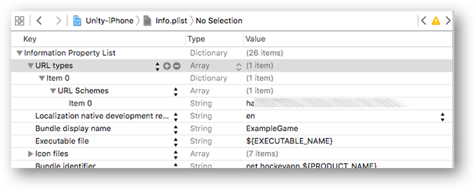

## Version 1.1.4
=======
**NOTE:** With the release of HockeySDK-Unity-iOS 1.1.0-beta.1 a bug was introduced which lead to the exclusion of the app's Application Support folder from iCloud and iTunes backups.

If you have been using one of the affected versions (1.1.0-beta.1, 1.1.0), please make sure to update to at least version 1.1.1 of our SDK as soon as you can.

### Feedback and iOS 10
**The Unity HockeySDK for iOS Unity plugin removes the Feedback feature.**
The reason for this is that iOS 10 requires developers to add a usage string to their Info.plist in case they include the photos framework in their app. If this string is missing, the app will be rejected when submitting the app to the app store. As HockeyApp's Feedback feature includes a dependency to the photos framework. This means that if you include HockeyApp into your app, adding the usage string would be a requirement even for developers who don't use the Feedback feature. If you don't use Feedback in your app, simply upgrade HockeySDK to version 1.1.4. If you need the feedback feature you have to use version 1.1.2 or lower. If you are using an older version of the SDK, you must add a `NSPhotoLibraryUsageDescription` to your `Info.plist` to avoid a AppStore rejection during upload of your app.

## Introduction 

HockeySDK-Unity-iOS implements support for using HockeyApp in your Unity iOS applications.

The following features are currently supported:

1. **Collect crash reports:** If your app crashes because of your native code, a crash log with the same format as from the Apple Crash Reporter is written to the device's storage. If the user starts the app again, he is asked to submit the crash report to HockeyApp. This works for both beta and live apps, i.e. those submitted to the App Store.

2. **Collect exceptions** The HockeySDK-Unity-iOS can automatically report uncaught managed exceptions comming from your managed code. Just like crashes, those exceptions will be sent on the next app start and are displayed on HockeyApp

3. **[NEW] User Metrics** Understand user behavior to improve your app. Track usage through daily and monthly active users. Monitor crash impacted users. Measure customer engagement through session count.

4. **Update Ad-Hoc / Enterprise apps:** The app will check with HockeyApp if a new version for your Ad-Hoc or Enterprise build is available. If yes, it will show an alert view to the user and let him see the release notes, the version history and start the installation process right away. 

5. **Authenticate:** Identify and authenticate users of Ad-Hoc or Enterprise builds

This document contains the following sections:

1. [Requirements](#1)
2. [Installation & Setup](#2)
3. [Examples](#3)
4. [Troubleshooting](#4)
5. [Code of Conduct](#5)
6. [Contributor License](#6)
7. [Licenses](#7)

## Requirements
* [Changelog](Documentation/Changelog.md)
* Unity 5.0 or newer (SDK versions with Unity 4 support can be found at the [Unity Asset Store](https://www.assetstore.unity3d.com/en/?gclid=CO) or by switching to the 1.0.4 tag on GitHub).
* iOS 6.0 or newer.

## Installation & Setup

The following steps illustrate how to integrate the HockeyAppUnity-iOS plugin:

### 1) Import plugin
You can either import the plugin [from the Asset Store](https://www.assetstore.unity3d.com/en/#!/content/17757) or download the *.unitypackage* from our [GitHub releases page](https://github.com/bitstadium/HockeySDK-Unity-iOS/releases) and install it by doubleclicking the file. That's it!

In case you've cloned the repo, simply copy the **HockeyAppUnityIOS** folder as well as the **Editor** folder into the **Assets** directory of your Unity project. Both folders are subdirectories of the **Plugin** folder.

### 2) Create plugin-GameObject
Create an empty game object (*GameObject -> Create Empty*) and rename it (*HockeyAppUnityIOS*).

Add the **HockeyAppIOS.cs** as a component of your new created gameobject.

Select the game object in the **Hierarchy** pane and fill in some additional informations inside the Inspector window. 

* **App ID** - the app ID provided by HockeyApp
* **Server URL** - if you have your own server instance, please type in its url. In most cases this field should be left blank.
* **Authenticator Type** - an authentication type (see [Authenticating Users on iOS](http://support.hockeyapp.net/kb/client-integration-ios-mac-os-x/authenticating-users-on-ios)). By default **BITAuthenticatorIdentificationTypeAnonymous** will be used.
* **Secret** - the secret provided by HockeyApp (only for authentication using email address)
* **Exception Logging** - by checking this option you will get more precise information about exceptions in your Unity scripts
* **Auto Upload Crashes** -  this option defines if the crash reporting feature should send crash reports automatically without asking the user on the next app start. 
* **Update Alert** - check this option if users should be informed about app updates from inside your app
* **User Metrics** - activating this feature will automatically usage data such as daily/monthly unique users and number of sessions per day

### 3) Configure build settings

You are now ready to build the Xcode project: Select *File -> Build Settings...* and switch to **iOS** in the platform section. Check **Development Build** and **Script Debugging** (see [Build Settings](#build_settings) section).

Open the player settings and make sure that **Bundle identifier** (*Other settings -> Identification*) equals the bundle identifier of the app on HockeyApp (*Manage App -> Basic Data*).

If you want to enable exception logging, please also select *Other settings -> Optimization -> Slow and safe* as well. Otherwise all exceptions will result in an app crash.

Press the **Build** button. You can now build and run your app.

Your app will now send crash reports and user metrics (e.g. daily/monthly unique users, # of sessions per day) to the server without doing any additional work. To see those statistics just visit your app on the portal.

### 4) Modify property list

This step only needs to be done if you want to use an authentication type other than **BITAuthenticatorIdentificationTypeAnonymous**.

1. Open your Info.plist of the exported Xcode project. It is usually stored in the root directory.
2. Add a new key **URL types** or **CFBundleURLTypes** (if Xcode displays the raw keys).
3. Change the key of the first child item to **URL Schemes** or **CFBundleURLSchemes**.
4. Enter **haAPP_ID** as the URL scheme with APP_ID being replaced by the App ID of your app.

## Build Settings

The **Development Build** and **Script Debugging** options affect the exception handling in C#. You will get a crash report in any case, but the data quality differs. It is recommend to enable those options for alpha and beta builds, but to disable them for production.

**Disabled Development Build, Disabled Script Debugging**:
	
Apple-style crash report for those exception types that cause a crash.

**Enabled Development Build, Disabled Script Debugging**

	IndexOutOfRangeException: Array index is out of range.
 		at (wrapper stelemref) object:stelemref (object,intptr,object)
 		at TestUI.OnGUI ()
 		
**Enabled Development Build, Enabled Script Debugging**:

	IndexOutOfRangeException: Array index is out of range.
 		at (wrapper stelemref) object:stelemref (object,intptr,object)
 		at TestUI.OnGUI () (at /Users/name/Documents/Workspace/HockeySDK-Unity-iOS/ExampleGame/Assets/TestUI/TestUI.cs:73)
 		
## Examples
	
### Explicitly check for updates

Usually, the update check happens everytime the app enters the foreground. If you'd like to explicitly trigger this check, please add the following to your code: 
	
	HockeyAppIOS.CheckForUpdate(); 
	
## Troubleshooting

If you have any problems with compiling the exported xCode projects, please check the following points:

### Libraries group

After exporting your Unity project, your xCode project should now contain the following files:

* **libHockeyAppUnity.a** & **HockeyAppUnityWrapper.m** (*Libraries/HockeyAppUnityIOS/*)
* **HockeySDKResources.bundle** (*Frameworks/HockeyAppUnityIOS/*)

If not, compiling your project will lead to different errors, e.g.

	Undefined symbols for architecture armv7:
  	  "_OBJC_CLASS_$_HockeyAppUnity", referenced from:
      	objc-class-ref in HockeyAppUnityWrapper.o
      	objc-class-ref in UnityAppController.o
      	objc-class-ref in UnityAppController+ViewHandling.o
	ld: symbol(s) not found for architecture armv7
	clang: error: linker command failed with exit code 1 (use -v to see invocation)
	
or

	ld: warning: directory not found for option '-L"/Path/to/project/Libraries"'
	Undefined symbols for architecture armv7:
  	  "_HockeyApp_StartHockeyManager", referenced from:
	      RegisterMonoModules() in RegisterMonoModules.o
	  "_HockeyApp_GetBundleIdentifier", referenced from:
	      RegisterMonoModules() in RegisterMonoModules.o
	  "_HockeyApp_GetAppVersion", referenced from:
	      RegisterMonoModules() in RegisterMonoModules.o
	ld: symbol(s) not found for architecture armv7
	clang: error: linker command failed with exit code 1 (use -v to see invocation)	

Please note that Unity only copies those files if you target them for iOS within Unity.

#### Authentication type not working

The **info.plist** of your xCode project should contain the key **URL types** with your app ID as value of one of its children (see [Modify Property List](#property_list)).

Furthermore, the following lines of code

	if([HockeyAppUnity handleOpenURL:url sourceApplication:sourceApplication annotation:annotation]){
        return YES;
    }

should be part of the method

	- (BOOL)application:(UIApplication*)application openURL:(NSURL*)url sourceApplication:(NSString*)sourceApplication annotation:(id)annotation

inside the class *Classes/UnityAppController.mm*.

#### Crash reporting / Update Manager not working

If the project compiles just fine but none of the features seem to work, please check the class *Classes/UI/UnityAppController+ViewHandling.mm*.

The last line of the method

	- (void)showGameUI
	
should be

	[HockeyAppUnity sendViewLoadedMessageToUnity];

This might also happen if you forgot to put the app ID inside the script form of the Unity project (see [Create plugin-GameObject](#create_game_object)).

## Code of Conduct

This project has adopted the [Microsoft Open Source Code of Conduct](https://opensource.microsoft.com/codeofconduct/). For more information see the [Code of Conduct FAQ](https://opensource.microsoft.com/codeofconduct/faq/) or contact [opencode@microsoft.com](mailto:opencode@microsoft.com) with any additional questions or comments.

## Contributor License

You must sign a [Contributor License Agreement](https://cla.microsoft.com/) before submitting your pull request. To complete the Contributor License Agreement (CLA), you will need to submit a request via the [form](https://cla.microsoft.com/) and then electronically sign the CLA when you receive the email containing the link to the document. You need to sign the CLA only once to cover submission to any Microsoft OSS project. 

## Licenses

The Hockey SDK is provided under the following license:

    The MIT License
    Copyright (c) Microsoft Corporation.
    All rights reserved.

    Permission is hereby granted, free of charge, to any person
    obtaining a copy of this software and associated documentation
    files (the "Software"), to deal in the Software without
    restriction, including without limitation the rights to use,
    copy, modify, merge, publish, distribute, sublicense, and/or sell
    copies of the Software, and to permit persons to whom the
    Software is furnished to do so, subject to the following
    conditions:

    The above copyright notice and this permission notice shall be
    included in all copies or substantial portions of the Software.

    THE SOFTWARE IS PROVIDED "AS IS", WITHOUT WARRANTY OF ANY KIND,
    EXPRESS OR IMPLIED, INCLUDING BUT NOT LIMITED TO THE WARRANTIES
    OF MERCHANTABILITY, FITNESS FOR A PARTICULAR PURPOSE AND
    NONINFRINGEMENT. IN NO EVENT SHALL THE AUTHORS OR COPYRIGHT
    HOLDERS BE LIABLE FOR ANY CLAIM, DAMAGES OR OTHER LIABILITY,
    WHETHER IN AN ACTION OF CONTRACT, TORT OR OTHERWISE, ARISING
    FROM, OUT OF OR IN CONNECTION WITH THE SOFTWARE OR THE USE OR
    OTHER DEALINGS IN THE SOFTWARE.

Except as noted below, PLCrashReporter 
is provided under the following license:

    Copyright (c) 2008 - 2015 Plausible Labs Cooperative, Inc.
    Copyright (c) 2012 - 2015 HockeyApp, Bit Stadium GmbH.
    All rights reserved.

    Permission is hereby granted, free of charge, to any person
    obtaining a copy of this software and associated documentation
    files (the "Software"), to deal in the Software without
    restriction, including without limitation the rights to use,
    copy, modify, merge, publish, distribute, sublicense, and/or sell
    copies of the Software, and to permit persons to whom the
    Software is furnished to do so, subject to the following
    conditions:

    The above copyright notice and this permission notice shall be
    included in all copies or substantial portions of the Software.

    THE SOFTWARE IS PROVIDED "AS IS", WITHOUT WARRANTY OF ANY KIND,
    EXPRESS OR IMPLIED, INCLUDING BUT NOT LIMITED TO THE WARRANTIES
    OF MERCHANTABILITY, FITNESS FOR A PARTICULAR PURPOSE AND
    NONINFRINGEMENT. IN NO EVENT SHALL THE AUTHORS OR COPYRIGHT
    HOLDERS BE LIABLE FOR ANY CLAIM, DAMAGES OR OTHER LIABILITY,
    WHETHER IN AN ACTION OF CONTRACT, TORT OR OTHERWISE, ARISING
    FROM, OUT OF OR IN CONNECTION WITH THE SOFTWARE OR THE USE OR
    OTHER DEALINGS IN THE SOFTWARE.

The protobuf-c library, as well as the PLCrashLogWriterEncoding.c
file are licensed as follows:

    Copyright 2008, Dave Benson.

    Licensed under the Apache License, Version 2.0 (the "License");
    you may not use this file except in compliance with
    the License. You may obtain a copy of the License
    at http://www.apache.org/licenses/LICENSE-2.0 Unless
    required by applicable law or agreed to in writing,
    software distributed under the License is distributed on
    an "AS IS" BASIS, WITHOUT WARRANTIES OR CONDITIONS OF ANY
    KIND, either express or implied. See the License for the
    specific language governing permissions and limitations
    under the License.

TTTAttributedLabel is licensed as follows:

    Copyright (c) 2011 Mattt Thompson (http://mattt.me/)
    
    Permission is hereby granted, free of charge, to any person
    obtaining a copy of this software and associated documentation
    files (the "Software"), to deal in the Software without
    restriction, including without limitation the rights to use,
    copy, modify, merge, publish, distribute, sublicense, and/or sell
    copies of the Software, and to permit persons to whom the
    Software is furnished to do so, subject to the following
    conditions:

    The above copyright notice and this permission notice shall be
    included in all copies or substantial portions of the Software.

    THE SOFTWARE IS PROVIDED "AS IS", WITHOUT WARRANTY OF ANY KIND,
    EXPRESS OR IMPLIED, INCLUDING BUT NOT LIMITED TO THE WARRANTIES
    OF MERCHANTABILITY, FITNESS FOR A PARTICULAR PURPOSE AND
    NONINFRINGEMENT. IN NO EVENT SHALL THE AUTHORS OR COPYRIGHT
    HOLDERS BE LIABLE FOR ANY CLAIM, DAMAGES OR OTHER LIABILITY,
    WHETHER IN AN ACTION OF CONTRACT, TORT OR OTHERWISE, ARISING
    FROM, OUT OF OR IN CONNECTION WITH THE SOFTWARE OR THE USE OR
    OTHER DEALINGS IN THE SOFTWARE.

SFHFKeychainUtils is licensed as follows:

    Created by Buzz Andersen on 10/20/08.
    Based partly on code by Jonathan Wight, Jon Crosby, and Mike Malone.
    Copyright 2008 Sci-Fi Hi-Fi. All rights reserved.
    
    Permission is hereby granted, free of charge, to any person
    obtaining a copy of this software and associated documentation
    files (the "Software"), to deal in the Software without
    restriction, including without limitation the rights to use,
    copy, modify, merge, publish, distribute, sublicense, and/or sell
    copies of the Software, and to permit persons to whom the
    Software is furnished to do so, subject to the following
    conditions:

    The above copyright notice and this permission notice shall be
    included in all copies or substantial portions of the Software.

    THE SOFTWARE IS PROVIDED "AS IS", WITHOUT WARRANTY OF ANY KIND,
    EXPRESS OR IMPLIED, INCLUDING BUT NOT LIMITED TO THE WARRANTIES
    OF MERCHANTABILITY, FITNESS FOR A PARTICULAR PURPOSE AND
    NONINFRINGEMENT. IN NO EVENT SHALL THE AUTHORS OR COPYRIGHT
    HOLDERS BE LIABLE FOR ANY CLAIM, DAMAGES OR OTHER LIABILITY,
    WHETHER IN AN ACTION OF CONTRACT, TORT OR OTHERWISE, ARISING
    FROM, OUT OF OR IN CONNECTION WITH THE SOFTWARE OR THE USE OR
    OTHER DEALINGS IN THE SOFTWARE.

GZIP is licensed as follow:
    
    Created by Nick Lockwood on 03/06/2012.
    Copyright (C) 2012 Charcoal Design
    
    Distributed under the permissive zlib License
    Get the latest version from here:
    
    https://github.com/nicklockwood/GZIP
    
    This software is provided 'as-is', without any express or implied
    warranty.  In no event will the authors be held liable for any damages
    arising from the use of this software.
    
    Permission is granted to anyone to use this software for any purpose,
    including commercial applications, and to alter it and redistribute it
    freely, subject to the following restrictions:
    
    1. The origin of this software must not be misrepresented; you must not
    claim that you wrote the original software. If you use this software
    in a product, an acknowledgment in the product documentation would be
    appreciated but is not required.
    
    2. Altered source versions must be plainly marked as such, and must not be
    misrepresented as being the original software.
    
    3. This notice may not be removed or altered from any source distribution.
